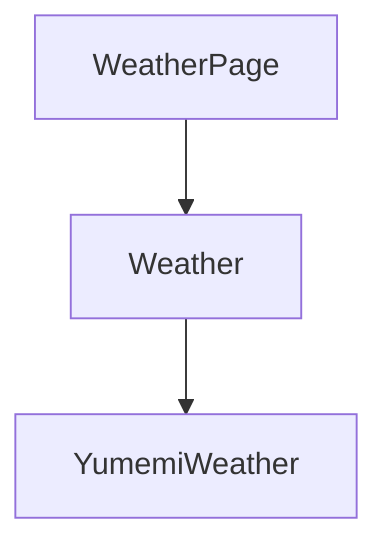
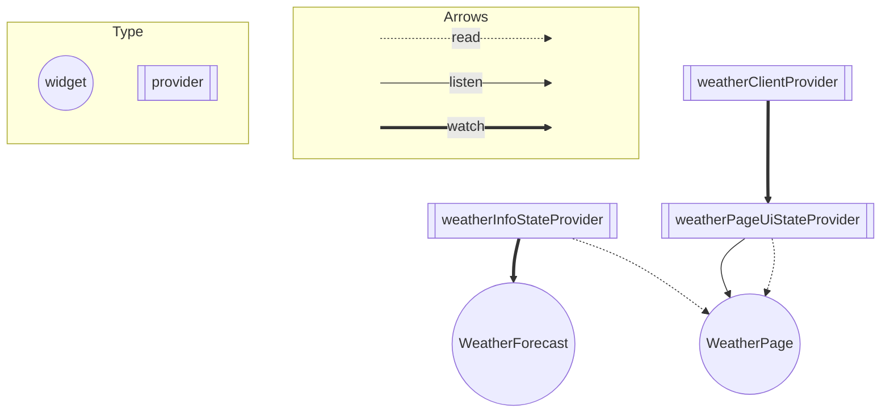
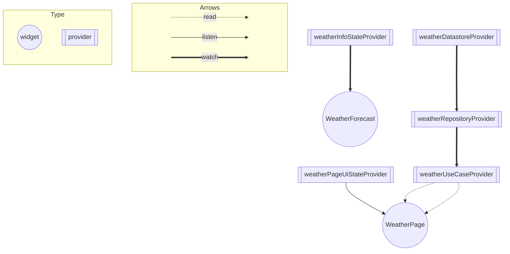

# 天気情報の状態管理

## Riverpod導入前の依存関係図

- WeatherPageがWeatherModelに依存し、
WeatherModelがYumemiWeather(WeatherClient)に依存している（DIしているから依存しているとは言わない...？）
- WeatherForecastは、WeatherPageから受け取った状態を元にUIを構築している

## Riverpod導入後のアーキテクチャ

### View
- WeatherForecast
  - WeatherInfoStateProviderのような、天気状態、最低・最高気温を管理しているProviderをwatchして状態を更新するようにする
- WeatherPage
  - weatherPageUiStateProviderをreadして、fetchWeatherを実行
  - weatherPageUiStateProviderをlisten
    - errorの時は、エラーダイアログを表示
    - successの時は、返ってきたweatherInfoの値を元に、WeatherInfoStateProviderを更新する

## Riverpod導入後のテストを意識したアーキテクチャ

### View
- WeatherForecast
  - WeatherInfoStateProviderをwatchして状態を更新する
- WeatherPage
  - Reloadボタンの押下時にfetchWeatherUseCaseProviderを使ってデータを取得する処理を実行
  - weatherPageUiStateProviderをlistenして「初期化時、エラー時」を判断
    - エラー時にはエラーダイアログを表示 

### UseCase
- プレゼンテーションを更新する処理
- repositoryからデータを取得
  - 取得したデータの内容によって各種Providerを更新

### Repository
- datastoreからデータを取得
- データをアプリで使いやすいやすい形に変換
- エラーハンドリングを行う
- Result型に変換してUseCaseに返す

### DataStore
- データ取得先を隠蔽する
- APIからデータを取得する
- jsonをMapに変換してrepositoryに返す

